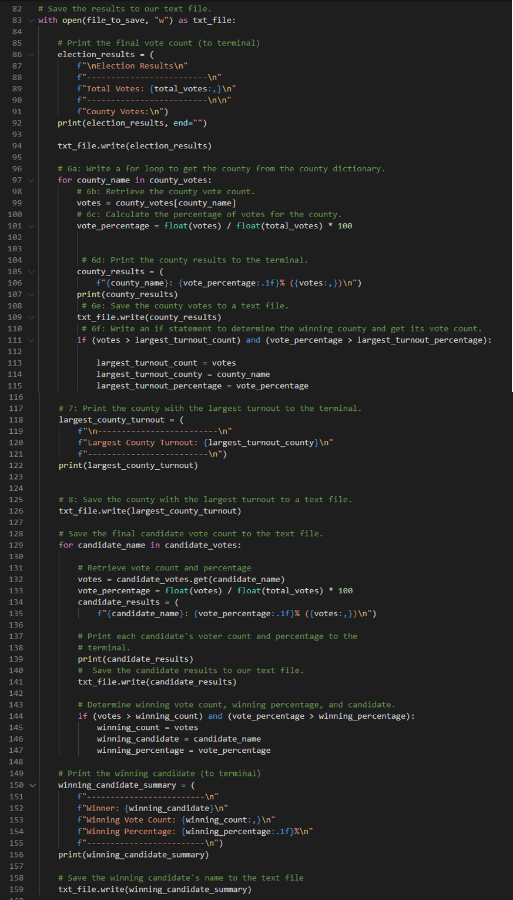
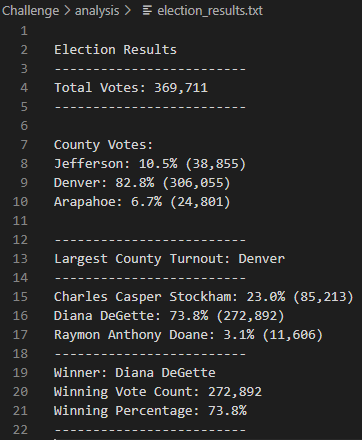

# PyPoll with Python

## I. Overview of Project

### Background
Tom, a Colorado Board of Elections employee, was tasked to do an election audit of their congressional precinct using Python. We were able to help him get the total votes, the number of votes for each candidate and their percentages, and the winner of the popular vote. 

### Objective
After successfully automating the election audit, the Election Commission has requested some additional data to complete the audit: (1) the voter turnout for each county, (2) the percentage of votes from each county out of the total county and (3) the county with the highest turnout.

## II. [Election-Audit Results](PyPoll_Challenge.py)

### A. Total Votes
- There were a **total of 369,711 votes** cast in this election.

### B. County Turnout
- Jefferson county cast **38,855 votes** for **10.5%** of the total votes.
- Denver county cast **306,055** votes for **82.8%** of the total votes.
- Arapahoe county cast **24,801** votes for **6.7%** of the total votes.
- **Denver has the largest number of votes** cast at 306,055.

### C. Election Results
- Charles Casper Stockham received **85,213 votes** for **23.0%** of the total votes.
- Diana DeGette received **272,892 votes** for **73.8%** of the total votes.
- Raymon Anthony Doane received **11,606 votes** for **3.1%** of the total votes.
- **Diana DeGette won this election**  with 272,892 votes and 73.8% of the total votes.

### C. Providing the Results
These results were saved in **election_result.txt** to so we can esily provide them to the Election Commission.   

The results saved in the file is shown below:

## III. Election-Audit Summary

Given the Tom's success in automating the election audit process for the congressional district elections. Tom can now propose using Python for election audits in other types of elections to the ELection Commission. The script we provided them is very flexible and can be modified for use in : **(1) local elections (using city data), (2) other congressional districts (using data from other counties), (3) senatorial districts (using statewide data) (4) and the whole country (using combined data from all the states)**.

Other possible applications are scrutinizing the areas with **low voter registration** and **low voter turnout** which is the **(number of votes casted) / (number of registered voters)**. 

